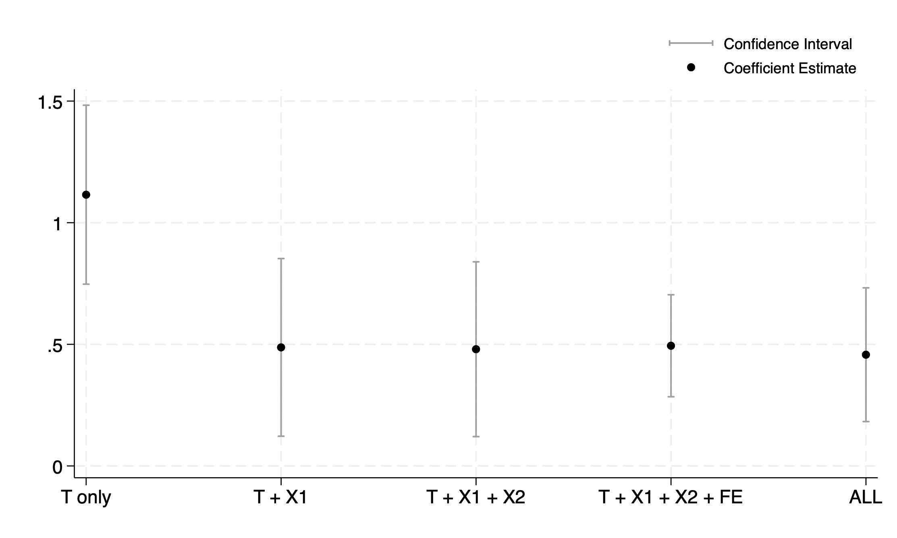
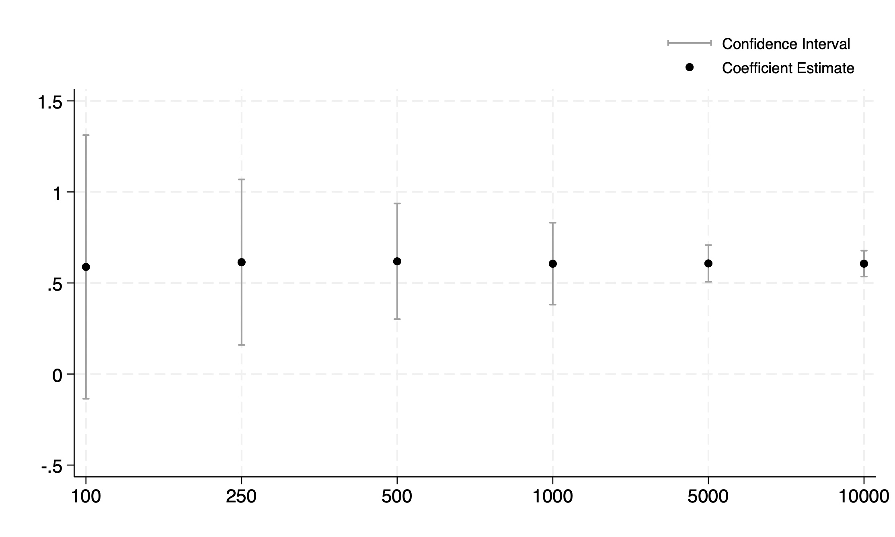

# Part 3: De-biasing a Parameter Estimate Using Controls

## 1. Model Overview

In this simulation study, I constructed a data-generating process (DGP) in which the outcome variable `Y` is influenced by a treatment variable `T`, two covariates `X1` and `X2`, and a group-level effect captured by `strata`. The treatment `T` is not randomly assigned but instead depends on both `X1` (a confounder) and `X3` (an irrelevant instrument-like variable). The true treatment effect is set to 0.5. I estimated this effect using five regression models:

1. `reg Y T`  
2. `reg Y T X1`  
3. `reg Y T X1 X2`  
4. `xtreg Y T X1 X2, fe` (strata fixed effects)  
5. `xtreg Y T X1 X2 X3, fe` (adds irrelevant variable)

Each model was run across varying sample sizes (N = 100 to 10,000) using repeated simulations to assess bias and convergence behavior.

## 2. Bias in Treatment Effect Estimates

The comparison across models reveals clear differences in bias. The naive model that includes only the treatment variable ("T only") produces a strongly upward-biased estimate, far from the true treatment effect of 0.5. This is due to omitted variable bias from leaving out `X1`, a confounder that affects both the treatment and the outcome. Once `X1` is included in the model (“T + X1”), the bias is effectively removed. Adding `X2`, which only affects the outcome, does not change the treatment estimate but improves precision slightly. The inclusion of fixed effects for `strata` further controls for unobserved group-level heterogeneity, yielding unbiased and more precise estimates. Including the irrelevant variable `X3` (which influences treatment but not outcome) does not bias the result but slightly increases variance.

#### Regression Estimates by Model

| Model | Estimate (`b`) | 95% CI (Low) | 95% CI (High) |
|-------|----------------|--------------|---------------|
| 1 (T only)            | 1.1151         | 0.7472       | 1.4830        |
| 2 (T + X1)            | 0.4875         | 0.1223       | 0.8526        |
| 3 (T + X1 + X2)       | 0.4799         | 0.1206       | 0.8392        |
| 4 (T + X1 + X2 + FE)  | 0.4942         | 0.2845       | 0.7039        |
| 5 (All covariates)    | 0.4574         | 0.1824       | 0.7323        |

## 3. Convergence Toward the True Effect

As the sample size increases, all correctly specified models show convergence toward the true treatment effect of 0.5. This is visible in the shrinking confidence intervals and increasingly stable coefficient estimates across larger `N`. The models that properly control for confounding (beginning with “T + X1”) consistently yield estimates centered around the true effect, even at moderate sample sizes. In contrast, the “T only” model remains biased regardless of `N`, indicating that increasing sample size cannot fix misspecification.

#### Regression Estimates by Sample Size

| Sample Size (N) | Estimate (`b`) | 95% CI (Low) | 95% CI (High) |
|-----------------|----------------|--------------|---------------|
| 100             | 0.5881         | -0.1359      | 1.3121        |
| 250             | 0.6143         | 0.1599       | 1.0686        |
| 500             | 0.6189         | 0.3013       | 0.9365        |
| 1000            | 0.6059         | 0.3811       | 0.8307        |
| 5000            | 0.6074         | 0.5069       | 0.7079        |
| 10000           | 0.6063         | 0.5352       | 0.6773        |

