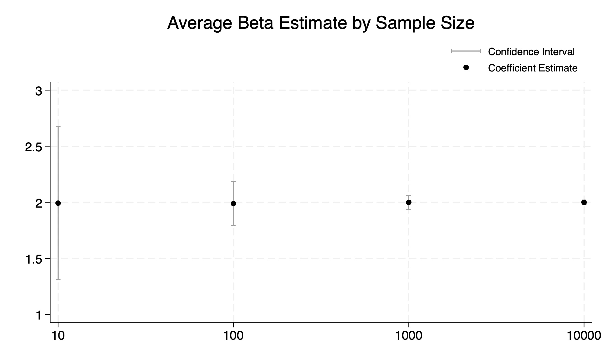
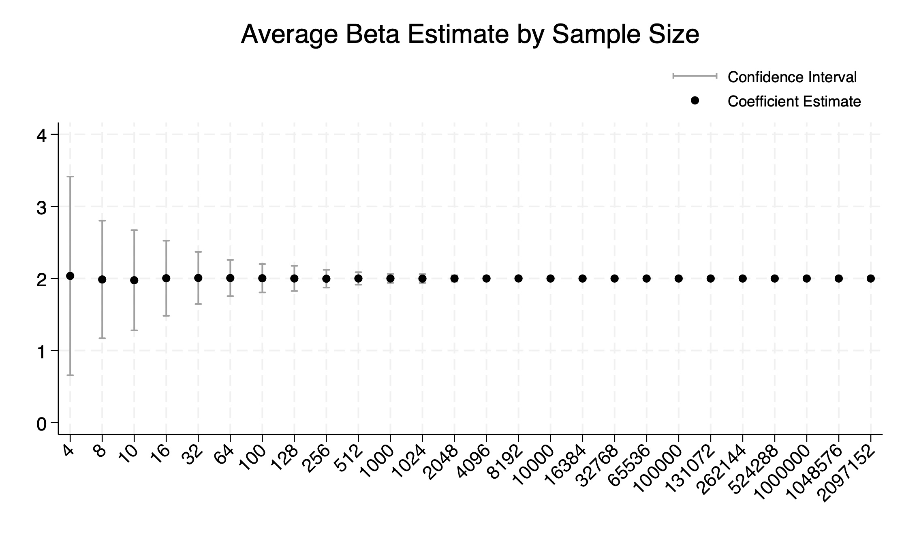
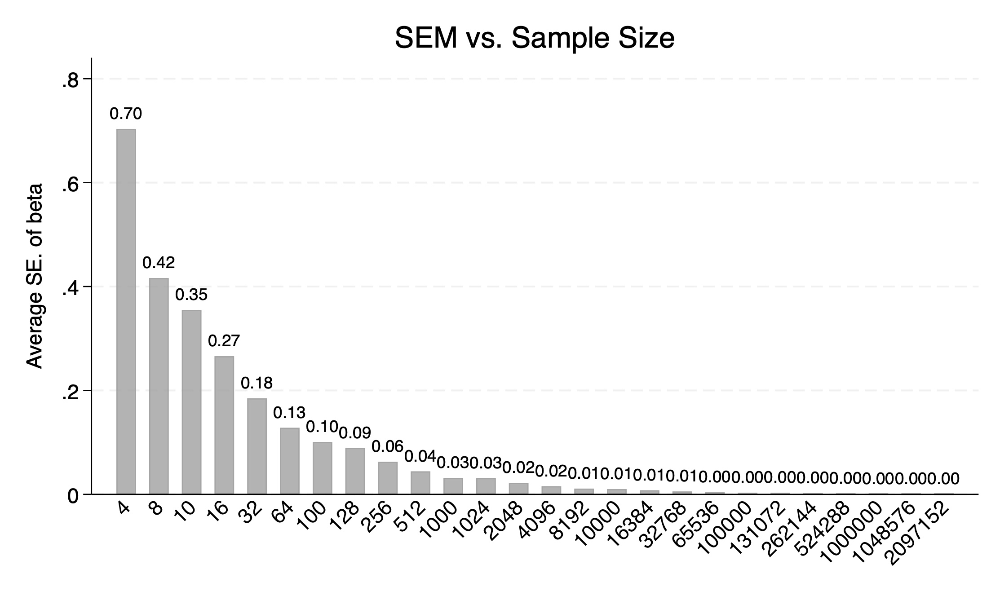
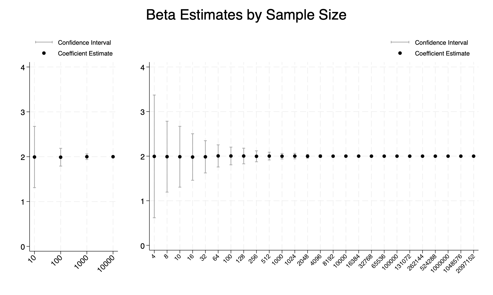
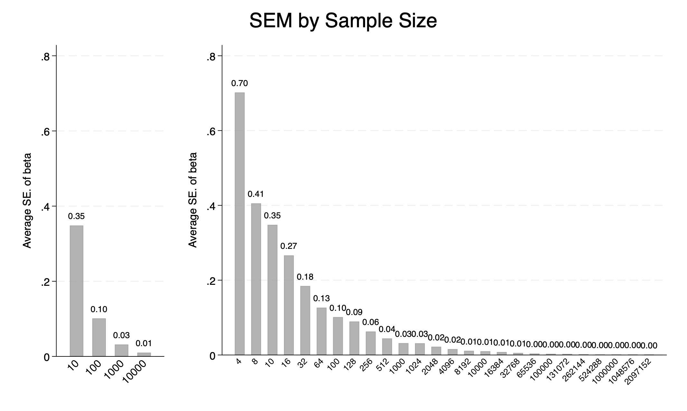

# STATA 3
### Part 1: Sampling noise in a fixed population

The population of x and y can be explained by following relationship: 

\[
y = 2x + \varepsilon, \quad \text{where } x \sim \mathcal{N}(0,1),\ \varepsilon \sim \mathcal{N}(0,1)
\]

This part simulate the regression results including estimated coefficient, standard error of estimated coefficient, and 95% confidence interval 500
times for each size (10, 100, 1000, and 10000) of random sample from the created population.

Table 1 and Figure 1 display the average beta estimates and corresponding confidence intervals across varying sample sizes, based on repeated 
samples drawn from a fixed population of 10,000 observations. The results suggest that the estimated coefficients remain relatively stable as 
sample size increases, indicating that the estimator is both unbiased and consistent. Furthermore, Table 1 and Figure 2 show that the standard 
error of the estimated coefficients decreases with larger sample sizes, demonstrating the expected gain in precision. This implies that as the 
sample size grows, our estimates become not only more stable but also more reliable, narrowing the uncertainty around the true parameter value 2.

**Table 1.** Average Regression by Sample Size with Fixed Population
| r(N)   | r(beta)  | r(SEM)   | r(ci_high) | r(ci_low) |
|--------|----------|----------|------------|-----------|
| 10     | 1.992360 | 0.348318 | 2.675064   | 1.309656  |
| 100    | 1.988481 | 0.101150 | 2.186734   | 1.790228  |
| 1000   | 1.999264 | 0.031747 | 2.061489   | 1.937039  |
| 10000  | 1.999437 | 0.010030 | 2.019097   | 1.979778  |

**Figure 1**

**Figure 2**

### Part 2: Sampling noise in a fixed population
This part simulates sampling noise in an infinite superpopulation using the same data-generating process as in Part 1. For a range of sample sizes—from 4 to over 2 million—we drew 500 random samples at each size. In each simulation, we performed an OLS regression to estimate the slope coefficient (beta). For every run, we recorded the estimated coefficient, its standard error, and the 95% confidence interval. These values were then averaged across the 500 repetitions to summarize the behavior of the estimator at each sample size.

**Table 2.** Average Regression Estimates by Population Size
| r(N)     | r(beta)  | r(SEM)   | r(ci_high) | r(ci_low) |
|----------|----------|----------|------------|-----------|
| 4        | 1.994550 | 0.701975 | 3.370421   | 0.618679  |
| 8        | 1.988635 | 0.405332 | 2.783086   | 1.194183  |
| 10       | 1.987078 | 0.347940 | 2.669041   | 1.305115  |
| 16       | 1.980733 | 0.266189 | 2.502464   | 1.459002  |
| 32       | 1.985299 | 0.184445 | 2.346811   | 1.623787  |
| 64       | 2.005297 | 0.126513 | 2.253262   | 1.757331  |
| 100      | 2.004054 | 0.101261 | 2.202526   | 1.805582  |
| 128      | 2.002897 | 0.089426 | 2.178172   | 1.827621  |
| 256      | 1.996488 | 0.062708 | 2.119395   | 1.873581  |
| 512      | 2.001993 | 0.044294 | 2.088808   | 1.915177  |
| 1000     | 1.999059 | 0.031622 | 2.061038   | 1.937079  |
| 1024     | 2.001456 | 0.031242 | 2.062690   | 1.940221  |
| 2048     | 1.998186 | 0.022088 | 2.041478   | 1.954894  |
| 4096     | 2.000371 | 0.015628 | 2.031002   | 1.969740  |
| 8192     | 1.999435 | 0.011060 | 2.021113   | 1.977757  |
| 10000    | 2.000410 | 0.010002 | 2.020014   | 1.980806  |
| 16384    | 2.000625 | 0.007816 | 2.015944   | 1.985305  |
| 32768    | 1.999916 | 0.005525 | 2.010746   | 1.989086  |
| 65536    | 1.999798 | 0.003906 | 2.007453   | 1.992142  |
| 100000   | 2.000038 | 0.003162 | 2.006236   | 1.993840  |
| 131072   | 1.999925 | 0.002762 | 2.005338   | 1.994511  |
| 262144   | 1.999958 | 0.001953 | 2.003786   | 1.996130  |
| 524288   | 2.000000 | 0.001381 | 2.002707   | 1.997293  |
| 1000000  | 2.000009 | 0.001000 | 2.001969   | 1.998049  |
| 1048576  | 1.999979 | 0.000977 | 2.001893   | 1.998065  |
| 2097152  | 2.000006 | 0.000691 | 2.001360   | 1.998653  |

**Figure 3**

**Figure 4**

Figure 4 and 5 show the combined regression results of Part 1 and 2. In Part 1, we simulated samples from a fixed population. THis inherently limited the maximum sample size we could use to 10000. In contrast, Part 2 draws from an infinite super population. Because this population is not bounded by a fixed dataset, we can generate samples of any size by simulating as many observations as nedded directly from the normal distribution. As a result, Part 2 allows us to explore how sampling variability behaves at much larger scales. 

The reason why the sizes of the SEM and confidence intervals may differ at powers-of-ten sample sizes between Part 1 and Part 2 lies fundamentally in the difference in the sample generation process. In Part 1, all samples are drawn from a fixed finite population of 10,000 observations, which limits variability and constrains the randomness of the samples, especially at larger sample sizes. In contrast, Part 2 draws each sample independently from an infinite superpopulation, allowing for entirely new data to be generated for every sample. As a result, even for the same nominal sample sizes (e.g., 10, 100, 1,000, etc.), the actual content of the samples and thus the variability in estimated coefficients is different. This leads to observable differences in the resulting standard errors and confidence intervals across the two parts.

**Figure 5**

**Figure 6**

	

